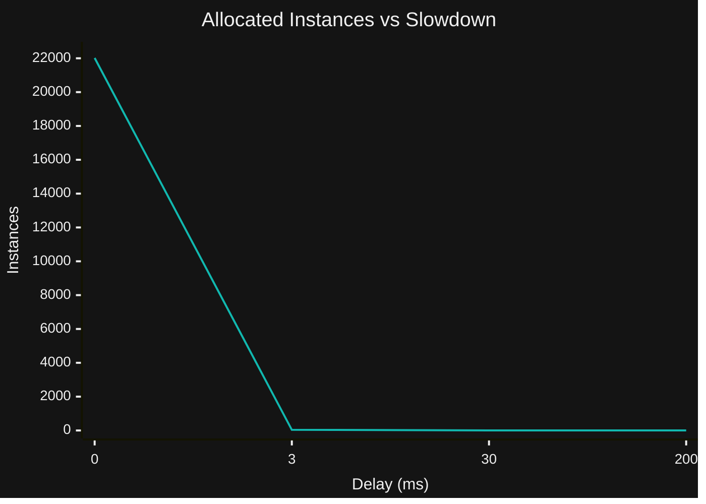
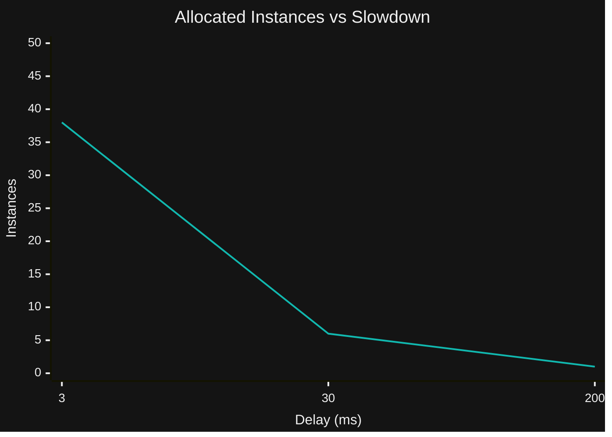

TODO: CHANGE IMAGE

ALL THESE EXAMPLES ARE WRONG, WAS NOT WAITING ON WAITGROUP

When programming you can end up with lots of data. In general if you want to store the number `5978`, that needs to be stored somewhere. In order to store it you first need to:

1. Tell the computer how much space it needs to store the value
2. Actually store the value in the allocated space
3. Clean up that memory when you're done with it


High level languages (like java, go, python, javascript, etc.) make managing memory easy. Typically you just tell the language your type, and store it. Something like `int x = 5978`. Lots of languages will also infer your types to make this easier. In go for example you can just say `x := 5987` and it will set the type for you (in this case an [at least 32-bit signed integer](https://stackoverflow.com/questions/21491488/what-is-the-difference-between-int-and-int64-in-go)). But what about step 3? How does the system know when to clean up?

## Garbage collection

In the languages I mentioned before (java, go, python, javascript) they **all** use garbage collectors. These are intricate systems that do analysis at compile time an runtime to make sure your memory is safe, and that your memory gets cleaned up from time to time. For now let's just say we will do a gc (garbage collection) every 2 function calls in the `main()` function. 

If we look at the following go code:

```go
package main

import (
	"fmt"
	"time"
)

func doStuff(x int){
  time.Sleep(30 * time.Millisecond)
  fmt.Println(x)  
}

func main(){
  y := 5897
  doStuff(y)

  z := 9807
  doStuff(z)
}
```

Right after `doStuff(y)`, we can see that `y` is never used again. So, if we were the garbage collector, and we run right after the first `doStuff()` we might decide to de-allocate the memory for `y` right then. 


In reality the process of when and how garbage collection happens gets quite complicated. V8, the engine that powers most javascript runtimes uses a fancy [generational approach (called Orinoco)](https://v8.dev/blog/trash-talk), and go just updated theirs to a new ["greentea"](https://go.dev/blog/greenteagc) system in 1.25. The important thing is, it's complicated, and it's something that has to **run alongside your program**. This gets even more complicated when we talk about composite data types (data types that contain others) like `objects` and `structs`.

## Objects & Structs

Composite data types (`objects` and `structs`) are complex. They often hold references to multiple bits of data, so cleaning them takes a bit of effort. This means every time you allocate a new instance of a `struct` or `object`, you silently are incurring the penalty of cleaning the memory for the fields, and the whole instance. Consider the following code in Go:

```go
package main

import (
	"fmt"
)

type User struct {
	Name string
	Age  int
}

type Set map[string]struct{}

func AllocateNormally(n int) Set {
	res := make(Set)
	for range n {
		q := User{Name: "kieran", Age: 27}
		res[fmt.Sprintf("%p", &q)] = struct{}{} // Store value with an empty flag

	}
	return res
}

func main() {
	pointers := AllocateNormally(50)
	fmt.Printf("Number of pointers in normal allocation: %d\n", len(pointers))
}
```

All it does is create a Set, and store the address of each struct instance in memory. There may be a few things you haven't seen:

- `struct{}{}` is basically acting like a boolean flag here. This acts like a set where if the pointer to a struct is the same it won't create an additional entry
- `%p` is used to get the pointer address. This is what's unique for each instance in memory

Here's a diagram of the first 2 iterations:


When `n` is small, this isn't a big deal. In the above example `n` is 50, meaning we did the overhead for instantiating, processing, and cleaning 50 struct instances. The garbage collector won't be the bottleneck here. But, what if we bump this to `n=50,000`?

```bash
$> go run main.go
Number of pointers in normal allocation: 38974
```

Why isn't this 50,000? To process 50,000 objects we had to allocate 38,974? Yep. This number will actually change each time we run it.

Behind the scenes this is using a very mild version of a very powerful performance optimization, instance pooling.

## Instance Pooling (TODO)

The `User` struct we were using above is basically just a bundle of data. Every time we're recreating it we're wasting memory. We could actually do all 50,000 instances with a single struct instance by recycling the struct and re-assigning the fields:

```go
func AllocateWithRecycling(n int) Set {
	res := make(Set)
	dataHolder := User{}
	for range n {
		dataHolder.Name = "kieran"
		dataHolder.Age = 27
		res[fmt.Sprintf("%p", &dataHolder)] = struct{}{}

	}
	return res
}
```

<details><summary>Full code here</summary>

```go
package main

import (
	"fmt"
	"time"
)

type User struct {
	Name string
	Age  int
}

var userPool = sync.Pool{
	New: func() any {
		return &User{}
	},
}

type Set map[string]struct{}

func AllocateNormally(n int) Set {
	res := make(Set)
	for range n {
		q := User{Name: "kieran", Age: 27}
		res[fmt.Sprintf("%p", &q)] = struct{}{}

	}
	return res
}

func AllocateWithRecycling(n int) Set {
	res := make(Set)
	dataHolder := User{}
	for range n {
		dataHolder.Name = "kieran"
		dataHolder.Age = 27
		res[fmt.Sprintf("%p", &dataHolder)] = struct{}{}

	}
	return res
}

func main() {

	pointers := AllocateNormally(50_000)
	fmt.Printf("Number of pointers in normal allocation: %d\n", len(pointers))
	pointers = AllocateWithRecycling(50_000)
	fmt.Printf("Number of pointers with recycling: %d\n", len(pointers))
}
```

</details>


We get:

```bash
$> go run .
Number of pointers in normal allocation: 43446
Number of pointers with recycling: 1
```

While this article is primarily about go, you can do this in other languages as well. Languages with more memory-hungry objects are a great use case for this technique. Here's an example in python:

```py
from dataclasses import dataclass

@dataclass
class User:
  name: str
  age: int

def allocate_normally(n:int) -> set:
  res = set()
  for _ in range(n):
    q = User("kieran", 27)
    res.add(id(q))
  return res

def allocate_with_recycling(n:int) -> set:
  res = set()
  data_holder = User("",0)
  for _ in range(n):
    data_holder.name = "kieran"
    data_holder.age = 27
    res.add(id(data_holder))
  return res

if __name__ == "__main__":
  print(f"Number of pointers in normal allocation: {len(allocate_normally(50_000))}")
  print(f"Number of pointers in recycled allocation: {len(allocate_with_recycling(50_000))}")
```

Python is actually very aggressive with it's pooling, so you get diminishing returns. It's probably only useful for long-running systems:

```bash
$> python q.py
Number of pointers in normal allocation: 28
Number of pointers in recycled allocation: 1
```

This is great, but it leaves us with a few problems...

### sync.Pool

With go we actually have more control, we can use [`sync.Pool`](https://pkg.go.dev/sync#example-Pool). There's basically 3 functions to care about:

- `New() any`: The function that creates a new instance of the struct we want to pool
- `Get() any`: Grabs an existing instance to re-use, or allocates one if the pool is empty
- `Put(instance any)`: Put back an instance of the struct to be re-used

The syntax is a bit messy, here is what creating the pool looks like:

```go
var userPool = sync.Pool{
	New: func() any {
		return &User{}
	},
}
```

We would then use: 

```go
myuser := userPool.Get().(*User) // Get a user and cast it to the User type
defer userPool.Put(myuser) // Put instance back for re-use or cleaning
```

We have to use `Get().(*User)` because `Get()` returns `any`, so we need to tell go what type it should interpret it as. So, let's see this in action. Here is our new code:

```go
import (
	"fmt"
	"sync"
)

var userPool = sync.Pool{
	New: func() any {
		return &User{}
	},
}


func AllocateViaPool(n int) Set {
	res := make(Set)
	for range n {
		q := userPool.Get().(*User)
		defer userPool.Put(q)
		q.Name = "kieran"
		q.Age = 27

		res[fmt.Sprintf("%p", &q)] = struct{}{}
	}
	return res
}
```


<details><summary>Full Code here</summary>

```go
package main

import (
	"fmt"
	"sync"
)

type User struct {
	Name string
	Age  int
}

var userPool = sync.Pool{
	New: func() any {
		return &User{}
	},
}

type Set map[string]struct{}

func AllocateNormally(n int) Set {
	res := make(Set)
	for range n {
		q := User{Name: "kieran", Age: 27}
		res[fmt.Sprintf("%p", &q)] = struct{}{}

	}
	return res
}

func AllocateViaPool(n int) Set {
	res := make(Set)
	for range n {
		q := userPool.Get().(*User)
		defer userPool.Put(q)
		q.Name = "kieran"
		q.Age = 27

		res[fmt.Sprintf("%p", &q)] = struct{}{}
	}
	return res
}

func main() {

	pointers := AllocateNormally(50_000)
	fmt.Printf("Number of pointers in normal allocation: %d\n", len(pointers))
	pointers = AllocateViaPool(50_000)
	fmt.Printf("Number of pointers in pool allocation: %d\n", len(pointers))
}

```

</details>


Now let's see this baby in action, how well did we do?


```bash
$>go run .
Number of pointers in normal allocation: 33686
Number of pointers in normal pool allocation: 45299
```

Worse than if we did nothing... Great.

Actually, this is pretty predictable. Much like garbage collection isn't free, neither is pooling. This is actually warned about directly in the documentation for [`sync.Pool`](https://pkg.go.dev/sync#Pool):

```go
// An appropriate use of a Pool is to manage a group of temporary items
// silently shared among and potentially reused by concurrent independent
// clients of a package. Pool provides a way to amortize allocation overhead
// across many clients.
//
// An example of good use of a Pool is in the fmt package, which maintains a
// dynamically-sized store of temporary output buffers. The store scales under
// load (when many goroutines are actively printing) and shrinks when
// quiescent.
//
// On the other hand, a free list maintained as part of a short-lived object is
// not a suitable use for a Pool, since the overhead does not amortize well in
// that scenario. It is more efficient to have such objects implement their own
// free list.
```

In this case our loop is mistiming when it's using our values, so it's actually de-optimizing the built in pooling. There can be a few causes:

1. The objects are not expensive enough to allocate, and don't live long enough, so the GC is faster than the pool
2. The go-routines are accessing the fields so quickly that none of the other instances have been set to recycle before being available

This means doing this yourself manually is often a matter of testing. So, why/when would you use this?

Well, it's in the `sync` package because it's main use case is concurrent processing. In particular when you have a large amount of memory being re-allocated. This situation does not use a lot of memory, but for simplicity, consider:

```go
func AllocateViaPoolSync(n int) Set {
	var (
		mu sync.Mutex
		wg sync.WaitGroup
	)
	res := make(Set)
	wg.Add(n)
	for range n {
		go func() {
			defer wg.Done()

			q := userPool.Get().(*User)
			defer userPool.Put(q)
			q.Name = "kieran"
			q.Age = 27

			mu.Lock()
			res[fmt.Sprintf("%p", &q)] = struct{}{}
			defer mu.Unlock()
		}()
	}
	return res
}
```

<details><summary>Full Code here</summary>

```go
package main

import (
	"fmt"
	"sync"
)

type User struct {
	Name string
	Age  int
}

var userPool = sync.Pool{
	New: func() any {
		return &User{}
	},
}

type Set map[string]struct{}

func AllocateNormally(n int) Set {
	res := make(Set)
	for range n {
		q := User{Name: "kieran", Age: 27}
		res[fmt.Sprintf("%p", &q)] = struct{}{}

	}
	return res
}

func AllocateViaPoolSync(n int) Set {
	var (
		mu sync.Mutex
		wg sync.WaitGroup
	)
	res := make(Set)
	wg.Add(n)
	for range n {
		go func() {
			defer wg.Done()

			q := userPool.Get().(*User)
			defer userPool.Put(q)
			q.Name = "kieran"
			q.Age = 27

			mu.Lock()
			res[fmt.Sprintf("%p", &q)] = struct{}{}
			defer mu.Unlock()
		}()
	}
	return res
}

func AllocateViaPool(n int) Set {
	res := make(Set)
	for range n {
		q := userPool.Get().(*User)
		defer userPool.Put(q)
		q.Name = "kieran"
		q.Age = 27

		res[fmt.Sprintf("%p", &q)] = struct{}{}
	}
	return res
}


func main() {

	pointers := AllocateNormally(50_000)
	fmt.Printf("Number of pointers in normal allocation: %d\n", len(pointers))
	pointers = AllocateViaPool(50_000)
	fmt.Printf("Number of pointers in normal pool allocation: %d\n", len(pointers))
	pointers = AllocateViaPoolSync(50_000)
	fmt.Printf("Number of pointers in pool allocation: %d\n", len(pointers))

}

```

</details>

Now, how did we do?

```bash
$> go run .
Number of pointers in normal allocation: 33686
Number of pointers in normal pool allocation: 45299
Number of pointers in concurrent pool allocation: 22019
```

So, we're only allocating ~%44 of the original number of instances, and we dropped an additional ~%35 of from our do-nothing case. But, where this approach really shines is when the instances are used to do some real work. Let's add a `3ms` delay after acquiring our lock to simulate some real work:

```go 
func AllocateViaPoolSync(n int) Set {
	var (
		mu sync.Mutex
		wg sync.WaitGroup
	)
	res := make(Set)
	wg.Add(n)
	for range n {
		go func() {
			defer wg.Done()

			q := userPool.Get().(*User)
			defer userPool.Put(q)
			q.Name = "kieran"
			q.Age = 27

			mu.Lock()
			res[fmt.Sprintf("%p", &q)] = struct{}{}
			time.Sleep(3 * time.Millisecond) // simulate work
			defer mu.Unlock()
		}()
	}
	return res
}
```

Now how does it look?

```bash
$> go run .
Number of pointers in normal allocation: 34863
Number of pointers in normal pool allocation: 45347
Number of pointers in pool allocation: 38
```

~%0.08 of the instances we would expect. The longer lived the instances, the more drastic this effect is. At 30ms we get:

```bash
$> go run .
Number of pointers in normal allocation: 33934
Number of pointers in normal pool allocation: 45345
Number of pointers in pool allocation: 6
```

At 200ms we get:

```bash
$> go run .
Number of pointers in normal allocation: 33656
Number of pointers in normal pool allocation: 43635
Number of pointers in pool allocation: 1
```

The difference is so stark that showing the whole graph is deceptive



Only including the slowdowns gives you a more "real" situation:



So, that's it right? Well, no. A few potential problems based on your use case.

#### Problems

**Reset** your instances; Instances are **recycled**, meaning the data fields are still set when you send them back. This often comes up when **converting** your code without pooling to using pooling. Imagine a system where you were processing user data, and you set a field to say if it's been processed or not yet:

```go
type User struct{
  Name string
  age int
  processed bool
}

func doSomething(instance *User){
  // Make sure instance hasn't already been processed
  if &instance.processed return // Do nothing since this struct has been processed
  
  // Now struct is reset, do something
}
```

If you're using a pool the processed flag is never reset like it is when using a normal `User{}`, so your code is fully broken.

Good, now you're recycling safely, just kidding. The `sync.Pool` is thread safe, not your values. We were actually trampling our values on each iteration. We just wouldn't notice it because we don't care about them. 

