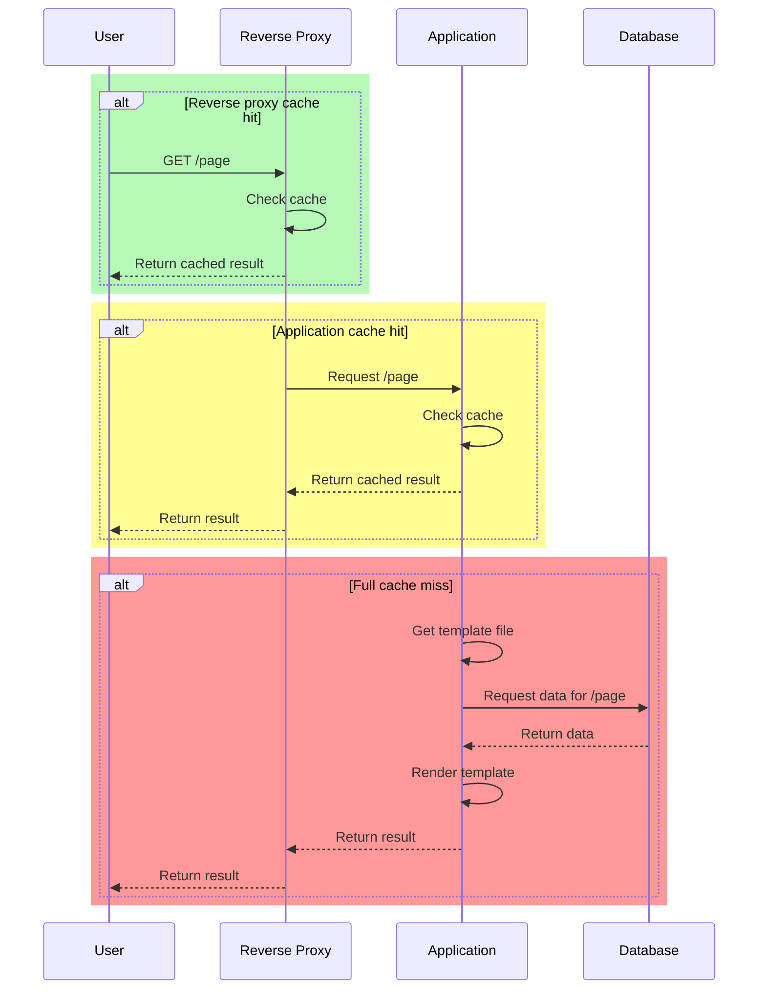
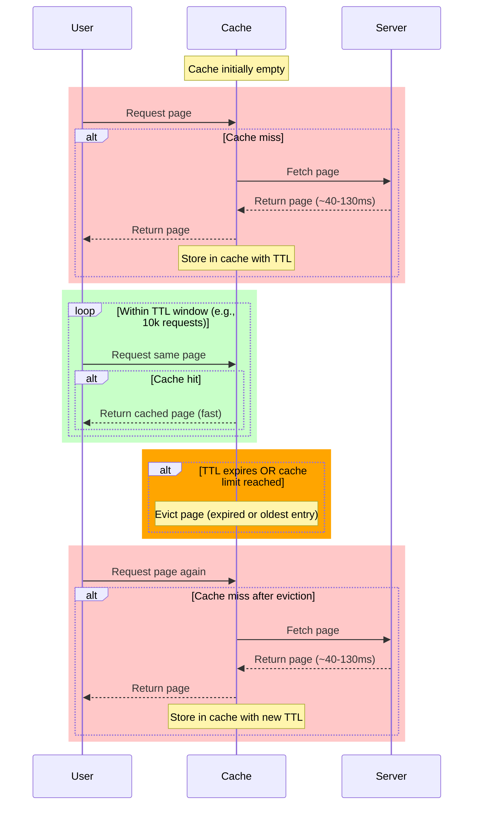
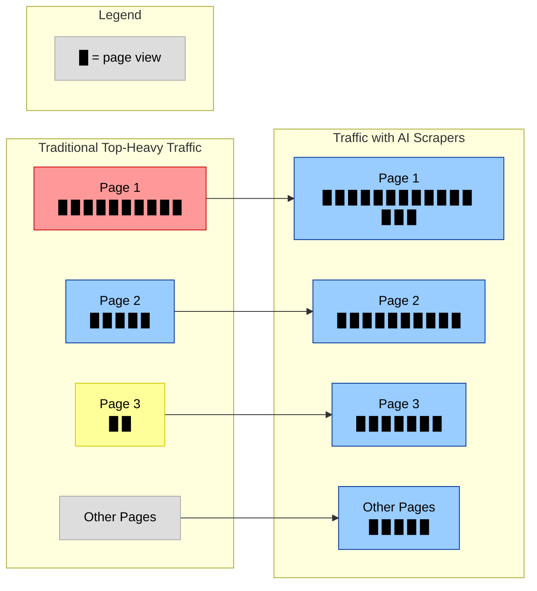
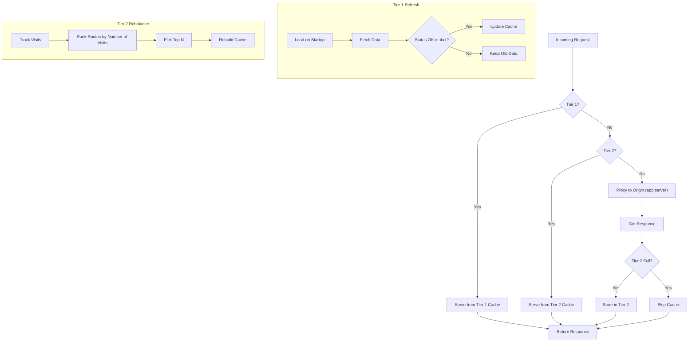

[Caching](https://kieranwood.ca/compsci/Programming/concepts/Caching) is a tricky problem. It's a constant balance of resource limits and performance. In particular when we look at websites and webapps there is a continuum of how "dynamic" they are. This continuum is mostly a short-hand for how much work we need to do to generate the final output we send to the client. When we just have plain web pages it's easy, we dump the file contents of the HTML/CSS/JS/Images to the client when it's requested. For highly dynamic apps like a stock-trading system, or safety monitoring system for manufacturing plants we need to be polling an API multiple times a second and re-generating the content. Lots of sites sit somewhere in the middle, and for those sites the new rules of engagement with AI companies has begun to pose a threat.

*If you are familiar with [TTL-based caching](https://kieranwood.ca/compsci/Programming/concepts/Caching#time-basedttl), CDN's, Firewalls and CMS systems feel free to skip to [here](#the-idea)*

## Typical Content-Heavy CMS Setup

To be more specific, sites that would traditionally be run on a CMS (content management system, like [WordPress](https://en-ca.wordpress.org/)) have seen their traffic spike due to AI data scraping. As companies are looking for as much data as possible to feed the unending hunger of their models, lots of sites are getting hit in the crossfire. I've seen jumps of up to %60 month-over-month. Many of these systems are just not designed to handle this kind of pressure. For those who have not worked with CMS sysetms much, the traditional flow for accessing data would typically include:

1. Request comes into a reverse-proxy ([nginx](https://nginx.org/), [Traefik](https://traefik.io/traefik), [Caddy](https://caddyserver.com/), [Apache](https://httpd.apache.org/), etc.)
2. If the requested slug is in cache it's returned immediately, else it's sent off to the app server and goes to step 3
3. The app receives the request for the route and processes it:
    1. Runs middlewear (auth checks, logs, application-level cache, etc.)
    2. Gets the associated template file
    3. Queries the database for the necessary data
    4. Renders the final result into a string combining the template and associated data
    5. Returns the result to the reverse proxy
4. Reverse proxy sends response and caches for a set [TTL](https://kieranwood.ca/compsci/Programming/concepts/Caching#time-basedttl) (time to live, usually ~5-30 mins)

This means our best case is in green (just step 1), then the second best is green + yellow (step 1, 2, step 3 is skipped \[application cache\], then 4), and worst is the whole diagram (steps 1-4):

I did some napkin math with a data I had from a few large sites across some diferent popular stacks ([WordPress](https://en-ca.wordpress.org/), [Drupal](https://new.drupal.org/home), [Ghost](https://ghost.org/)). Assuming ~200k pages, and perfect networks (over `localhost`) we might get something like 5-50ms for a reverse proxy cache hit, 25-90ms for an application cache hit, and 50-500ms for a cold-cache. That's without having to fight for bandwidth, and assuming little to no network contention on the DB side.

Despite most people's assumptions, most content-driven websites tend to be top-heavy. In general a handful of pages will account for most of your traffic. This works great because traditional simple cache systems tend to use TTL (time-to-live) caching where you just set a timeout, and during that timeout the page is constantly cached. Some systems are a bit fancier than this, and use more complicated LRU (Least Recently Used) algorithms, but many are just time-based. This means if you get 10k requests to a page in your timeout frame, the first one is slow (~40-130ms), then the rest are in caches. It will continue to do this until the timeouts are hit and the pages are evicted from the caches, or the cache goes over a set limit and clears out the oldest pages.

## The Elephant-sized AI in the Room

Simple TTL-based caching has worked great for a long time, and is (relatively) easy to understand. Unfortunately, with AI scrapers in the mix, most sites have gone from being top-heavy to a much more normally distributed number of views:

Pages that were accessed once a year or less may be getting 10-20 hits an hour, and your traffic on the popular pages also goes up by 10-20 hits an hour. This means you're constantly getting cold caches, you have more pressure on your most popular pages, and the slowness issues compound on each other as the pressure from old requests build. This can lead to slow pages, or in some cases a full on DOS (denial of service) where your site just keels over and dies.

## Existing Solutions

There are already a collection of existing possible ways to remedy these issues that are worth considering. Where possible you should probably try these approaches first before what I'm suggesting later.

### Hardware 

The simplest fix can often be just throwing more hardware at it. Just throw in a bit more RAM, up your caches until your whole site fits in, and you're good to go right? Actually, not so much. This can work, but it gets worse as you scale. If we're just talking about an HTML page, let's take an average of ~16kb of HTML data, at 200k pages thats 3.2GB of data. Depending on usage patterns that means you will also have to pay for the operations to initially generate that data, and maintain filling/updating it. If most of your pages are barely accessed that's a lot of memory contention.

Not to mention that you're still largely just blindly caching. Assuming you get enough hardware to keep more data in RAM, but not all of it. If your timeouts are too low for example you might find that you're hitting cold-caches at the worst times. Likewise, if your timeouts are too large you might have a precarious situation where your most popular page is in cache, gets evicted, another route is hit first and is cached, then your popular page is out of your caches for the whole timeout. Depending on how top-heavy the traffic is, this can be disasterous and lead to high cache-misses.

### Firewalls & CDN's

With the prevalence of AI scraping as an issue, several specialized firewall-adjacent solutions both open source[^1], and proprietary [^2] have sprung up. Ideally, you would need something that can alleviate pressure, and potentially show something as a fallback. One option that is pretty good is a [CDN (content delivery network)](https://kieranwood.ca/compsci/Programming/concepts/Caching#servercdn-cache) + firewall. A firewall to block as many bots as possible, and a CDN (like [Akamai](https://www.akamai.com/), [Cloudfront](https://aws.amazon.com/cloudfront/), [Fastly](https://www.fastly.com/) or [Cloudflare](https://www.cloudflare.com/application-services/products/cdn/)) to act as essentially an extra "reverse-proxy-like" layer to lower your overall pressure since it can keep things in cache. This is great since it's no longer **your problem**... 

Until it's not an option you can pick...

## The Idea

*It's important to note for this article that I'm writing it during the **ideation** phase of the project, meaning this is all just an idea. There will be an open-source version of whatever becomes of this project down the road, but for now, this is all theory. This approach has many odd side-effects and should be carefully considered before choosing it. Implement at your own risk.*

Unfortunately, I recently found myself in a situation where I had 2 different CMS systems I needed to optimize. Both had several layers of existing TTL caches ([Redis](https://redis.io/), [Varnish](https://www.varnish-software.com/products/varnish-cache/), [nginx](https://nginx.org/)/[Traefik](https://traefik.io/traefik)/[Apache](https://httpd.apache.org/) caches, etc.) that weren't cutting it. Additionally for various reasons I could not use external vendors **at all**. This means I needed to find a way to scale:

- **Without new hardware;** No one wanted the hassle, or the cost. Thanks again AI bros for making everything so expensive
- **Without major application-level changes;** There was no appetite to make massive overarching changes with how many people use the site, I can't give exact numbers but think several to tens of thousands of contributors and hundreds of thousands of users
- **Without vendors;** Can't go into details, but unfortunately it wasn't an option

So, I needed an infrastructure-level solution that would help solve the problems and avoid the outages we were running into that didn't need a ton of buy in on the developer side outside integrating it. We already had several TTL-based caching layers, and they were all getting exhausted regularly, so we needed a new paradigm entirely. To recap on all the background, here is the list of assumptions:

1. **Slow backend;** Something in a slow language PHP, Python, Javascript etc. Where the cost of cold caches and actually generating the result based on the template/component is relatively high
2. **Top-heavy;** You know your site has a set number of pages/routes that matter
3. **Single-node/cluster;** Buying more nodes elsewhere isn't an option
4. **Vendorless;** You can't use external vendors
5. **Enough discrete pages to overwhelm your caches;** You cannot comfortably fit everything in existing caches
6. **No new hardware;** Can't just expand your caches with more RAM
7. **No major changes to code;** Everything works, and no one wants to touch it

Enter what I call (and probably already has another name) usage-aware caching. To best explain the whole approach it's best to start with tiering, what it means, and what it gives us.

### Tiering

Simply put the primary mechanism that drives this system is a tiering strategy. This strategy basically organizes routes (slugs like `/` or `/about` for a site) into a heirarchy of importance. In this case we want to explicitly create 2 layers, and a third layer implicitly:

1. **Tier 1;** These are your most important pages that make up the majority of your traffic. These are **manually** configured by the system admin. When routes are in this tier they are stored initially on startup right away, then refreshed at a set interval (say every 5 mins). If there are any http `5xx` errors or timeouts on retrieval, then the value is not updated on the interval and the old data is retained until the next refresh cycle (since it's indicative of a server error). If a `4xx` error or valid value is returned then the system updates the value in it's cache. Any time this route is hit it's always served from the cache. 
2. **Tier 2;** This is a dynamic cache that operates similarly to traditional caches. You set a limit for the number of routes you want to include (let's say 5,000). The system will then begin to fill up the caches with responses as it goes until it hits the limit. After hitting the limit any new routes not in Tier 1 or Tier 2 are just reverse proxied to the application itself. Any routes not in Tier 1 will have a running tally kept of how many visits a route got. At the end of a set interval (say 30 mins) the visit numbers are used to decide which routes to include in the next intervals cache, these routes are regenerated, and if the number is less than the cap it will continue procesing down the list of routes until it's filled. At this tier `4xx` codes are considered errors, and responses containing them will not count towards the tally for that route. 
3. **Tier 3;** Everything not in the other 2 tiers. This tier just gets reverse-proxied to the app, and has to fight out with other requests for the application resources. This is also where routes you don't want to cache should end up (admin/editing interfaces, dynamic/live data APIs etc.)

To further clarify an earlier point, the reason we propogate `4xx` errors in **Tier 1** is that they indicate a user error (malformed path, unauthorized access, etc.), meaning the route is working **as intended**. However, in Tier 2 we wouldn't propogate `4xx` errors because we could open ourselves up to a DOS (denial of service) attack where people just spam nonsense links to fully fill our cache. Since we manually control Tier 1, unless the admin wants to DOS themselves we should respect the propogation. 

So, if you manually enter 100 routes into your Tier 1, and set your Tier 2 to 5,000 then you know that at most 5,100 pages will always be in your cache (if you have that many pages), and the rest will have to be processed via the application's processing pipelines. By default this system will also include the ability to specify static assets (images/css/js) and won't cache them. 

### Advantages

This tiering approach provides a few advantages.

#### Outage Resilience

This system helps you hedge against **visible** outages on your sites. Since everything lags-behind in your caches, if you have an outage the data will still be in the caches. So, as long as the cache layer doesn't go down, it will continue serving old-content. This *can* cause problems, most notably your uptime monitors will need to hit your routes from *behind* the caches to know if your site is up. However, this also means for high visibility sites (such as those in Tier 1) the uptime goes up dramatically even when there are issues such as multi-agent crawls happening on your site.

#### Semi-deterministic Caching

Since you know how many pages you are going to have within a given refresh interval, the resource usage is relatively deterministic. In fact it gets more deterministic as your priority increases (since Tier 2 is capped, and Tier 1 is manually configured). You will see I/O, memory and CPU spikes during refreshes, and besides that the only influence on resources will be the actual usage by users. This leads to more predictable idle usage than other cache systems where you can have a "caught with your pants down" moment where the caches have all been evicted after little-to-no use, and then you have a traffic spike that takes down your service. Since the caches are always at least partially warm your slowest time is at startup, and then pretty consistent after that. But, this does mean that overall there tends to be higher idle usage than other systems which have more of a ramp-down. 

This potentially could be mitigated by allowing more dynamic memory tier sizing over the day, where at peak usage times you have a larger tier 2 cap than at low-usage times, but this introduces it's own set of complexities and potential issues.

#### Usage-aware

Both cache layers are driven by **usage** not time. This means you're only caching the content you prioritize highly. In traditional TTL/LRU caching a page that happened to be visited by a crawler at the same time as the caches for a high priority page will evict the high priority page and leave you re-rendering the page, or serving it from the application-layer caches over and over again. Since this system lags behind and Tier 2 essentially generates as you go, this means you have the pages that are **actually** visited showing up more often in caches. There is a somewhat obvious problem with this though. What if your traffic tends to be bursty and concentrated within a set time range?

As an example let's say you get most of your traffic at 11am for 20 mins, and your tier 2 timeout is 30 mins. This means that effectively you miss the burst at your most critical time. I am currently looking into a few possible solutions to this. One of which would be to make the usage tallies for counts last longer than a single interval. For example, you could set a time each day to reset the values, or some other longer-term clearing effect. This would mean that, assuming the popular pages are the same across-days, you would already be pre-filled with content that will show up for the burst, but this isn't guaranteed. 

There are more complicated heuristics I've considered, but this is just a hard problem, and will likely come down to providing configuration options to adjust this behaviour more granularly for each sites use cases.

#### Batching

In general, instead of getting ad-hoc requests, your application server will now get a batch of requests at the set interval. This means depending on your refresh time budget you can choose exactly how much resource usage you want to use by pooling your refresh into sub-batches. For example, let's say you have 100 routes in your Tier 1 cache, you can now set a rate limit to say on refresh you only want to process 20 at a time. This means you can spread out the resource cost of the refresh over a given time interval, serving "stale" content in the meantime. This means that in cases that might overwhelm your server, like say a refresh of 5,000 pages for your Tier 2, you can set a timeout per request and only ever have 50 requests in-flight at a time. You can tweak these numbers for **your use case**, to get the right balance of server load for resource cost.

#### Framework Independent

While not true in the strictest sense, this system has very little framework coupling. Since it's just HTML pages being cached it works the same across any framework that produces HTML. In my initial exploratory testing I've found this to be a good and bad thing (more on that in a second). This does mean this approach can be re-used for essentially any system that produces HTML, meaning you can re-use it in many different systems without having to learn separate technologies.

#### Middlewear

Many CMS's have different routes for authorization vs public facing routes. Even on these public facing routes the CMS will check if you're logged in to retain the admin UI. While this is a nice UX for editors, it also means every cold-cache hit has to be processed through the middlewear. Being able to skip all these checks (or amortize them to only the cost on refreshes) means you can find out quickly if the middlewear is a bottleneck or not for you. 

### Downsides

Like everything in life, there are tradeoffs even in theory with this approach. I am only mentioning a few of the less obvious ones I can think of, but there are many others depending on your use-case.

#### Obfuscation

This approach massively obfuscates your insights into usage outside the network. Because the cache-layer is now intercepting more of the traffic it can hide outages you would typically catch. Likewise this can obfuscate KPI metrics that might cause you to re-adjust your infrastructure. For example if requests from your application take 300ms, but your cache layer takes 20-30ms, and the majority is served from your cache, you may mistakingly assume that 20-30ms is how long it takes your app to respond. This can be dangerous in that you might only catch how slow your underlying applciation is when something goes wrong in your cache layer and you have to operate without it.

#### Framework Independence

While being framework agnostic might seem like a positive, it leaves a lot of performance on the table. Many optimizations become impossible to do. Another experimental approach I looked at a while back involved turning the CMS into a more headless system for editing, and then just generating the HTML in a faster language. This works well in circumstances where you're doing actual data processing, and are not just I/O bound to the database. Likewise, depending on what's actually costing you the most amount of time, these deeper integrations can have more of an impact.

Additionally, being a network proxy I've found some CMS's have weird behaviors you might not expect depending on how you modify the incoming requests. WordPress for example has odd behaviors around dynamically changing its site address based on incoming requests' `Host` header that left me scratching my head for a bit when doing some testing. This gets weirder and weirder depending on how many infrastructure layers you stack on top.

#### Middlewear

As I said earlier because the request is handled at the cache layer middlewear is skipped. This potentially helps performance, but it means that you can lose functionality that requires that middlewear. For example, if your CMS supports going to "live" pages to edit them, which requires you to be logged in, it will break with this system since the auth is skipped completely.

## Wrap it up

I'm sure this pattern already has a name I've never heard of. The solution is as simple as I could come up with under the constraints, but as I mentioned the best option overall would be to just fix the underlying issues, and using a CDN. But for those of you who are like me and don't have that option, this is an interesting possible solution, and when there is an open-source implementation available I will update this post to try it out.

**EDIT**: Since posting and beginning working on a solution, clouflare has actually come to a similar conclusion about this issue. They are tackling it in a different, but interesting way for readers interested. You can find details in their [recent blog post](https://blog.cloudflare.com/rethinking-cache-ai-humans/)

[^1]: https://github.com/TecharoHQ/anubis
[^2]: https://developers.cloudflare.com/bots/
